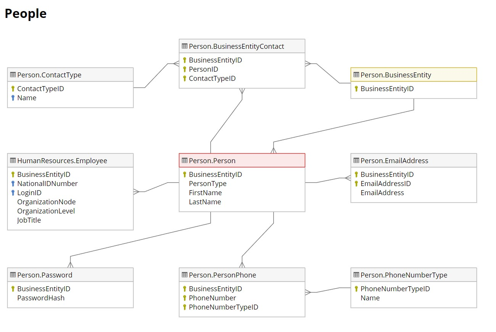
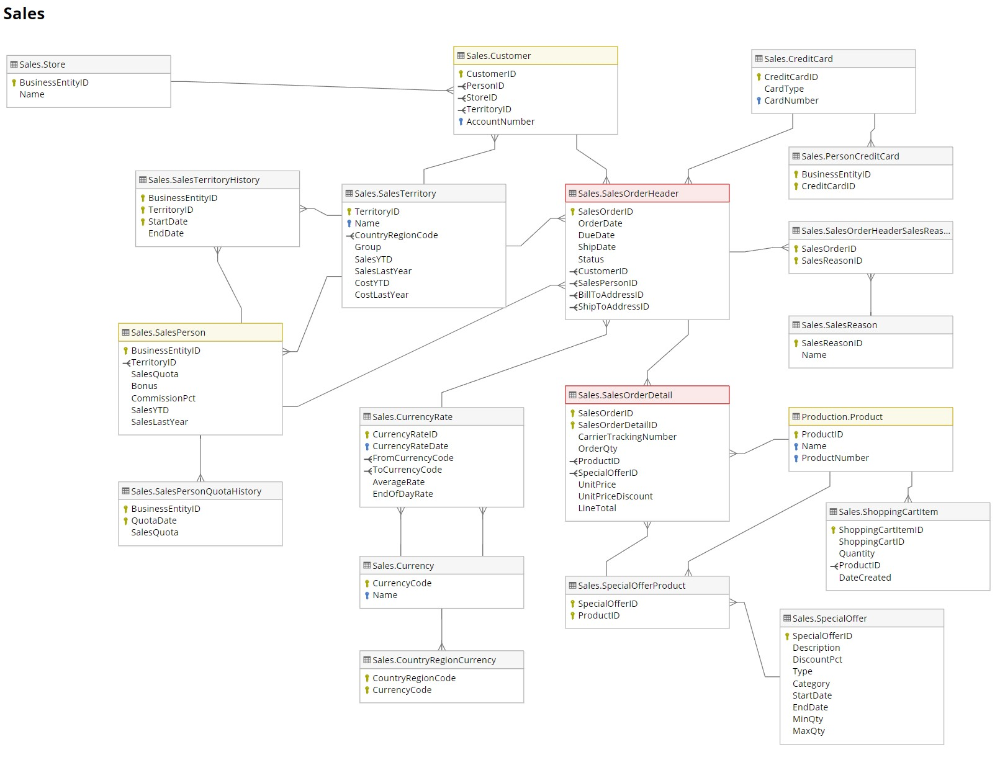

# Adventure Works Cycles Business Scenario Project

  

## Introduction

AdventureWorks is a sample database provided by Microsoft SQL Server, which supports standard online transaction processing scenarios for Adventure Works Cycles, a fictitious bicycle manufacturer that produces and sells metal and composite bicycles to worldwide. There are a total of 68 tables in the sample database constituted by 9 scenarios (i.e. Business Entities, People, Human Resources, Products, Manufacturing, Purchasing, Inventory, Sales, and Admin). Knowing that customers' demographic and sales-related information are crucial for driving business strategy in real life, this project aims to implement SQL querying techniques in PostgreSQL to explore, manipulate data majorly in "People" and "Sales" scenarios, and transform it into useful data for business report.

## People Scenario Tables (Schema "Person")
This schema consists of names and addresses of individual customers, vendors, and employees. There are 13 tables in this schema:

- Person.Address
- Person.AddressType
- Person.BusinessEntity
- Person.BusinessEntityAddress
- Person.BusinessEntityContact
- Person.ContactType
- Person.CountryRegion
- Person.EmailAddress
- Person.Password
- Person.Person
- Person.PersonPhone
- Person.PhoneNumberType
- Person.StateProvince

Entity Relationship diagram is shown below:

  

## Sales Scenario Tables (Schema "Sales")
This schema contains information about shopping cart, sales orders, special offers and sales people. There are 19 tables in this schema:

- Sales.CountryRegionCurrency
- Sales.CreditCard
- Sales.Currency
- Sales.CurrencyRate
- Sales.Customer
- Sales.PersonCreditCard
- Sales.SalesOrderDetail
- Sales.SalesOrderHeader
- Sales.SalesOrderHeaderSalesReason
- Sales.SalesPerson
- Sales.SalesPersonQuotaHistory
- Sales.SalesReason
- Sales.SalesTaxRate
- Sales.SalesTerritory
- Sales.SalesTerritoryHistory
- Sales.ShoppingCartItem
- Sales.SpecialOffer
- Sales.SpecialOfferProduct
- Sales.Store

Entity Relationship diagram is shown below:

  

## The Workflow

The process for building this report was as follows (and can be viewed in the yaml file in the repo):

## SQL Queries

- Q1: Create list of customer demographic (i.e. contact number, email address, name, total purchase price ytd).
- Q2: Create descriptive table describing count of cusomters, maximum/minimum/average/standard deviation of total purchase YTD amount aggregated by their preference in email subscription:
  
      0 = Contact does not wish to receive e-mail promotions
  
      1 = Contact does wish to receive e-mail promotions from AdventureWorks
  
      2 = Contact does wish to receive e-mail promotions from AdventureWorks and selected partners
  
  It is interesting to observe that the minimum number total purchase year-to-date amount is negative. It could be due to poor cost value of the products or poor monitoring of product causing request of refund.
  
- Q3:
- Q4:
- Q5: List top 5 sales person's demographic having **highest** growth in sales comparing to last year and calculate the projected net profit received by company if sales person meets the sales quota after excluding commission and bonus.
- Q6: List top 5 sales person's demographic having **lowest** growth in sales comparing to last year and calculate the projected net profit received by company if sales person meets the sales quota after excluding commission and bonus.
- Q7:

Next, the set_current_status query checks all vanids for how many events they've completed in the last 14 and 30 days, and assigns a status based on the count. Currently it is set up as follows:

- Super Active: at least 2 completed shifts in the last 14 days
- Active: less than 2 completed shifts in the last 14 days, at least 2 completed in the last 30 days
- Almost Active: 1 completed  shift in the last 30 days
- Drop Off: Has once signed up, but has not completed a shift in the last 30 days

## Tool
- PostgreSQL (Version: 16.RC1)

## Dataset
- [Link](https://github.com/lorint/AdventureWorks-for-Postgres)

## Author
- [Shirley Hung](www.linkedin.com/in/shirley-hung-54a749229)

